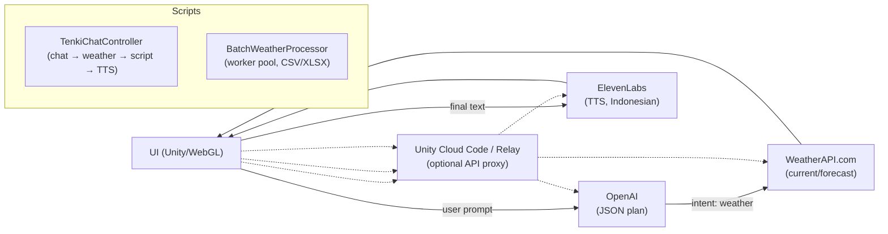
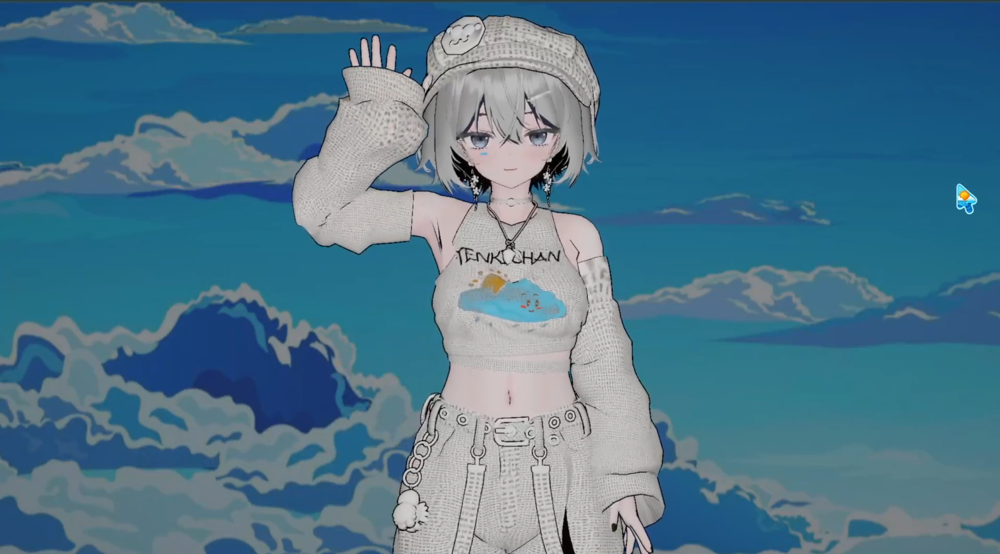
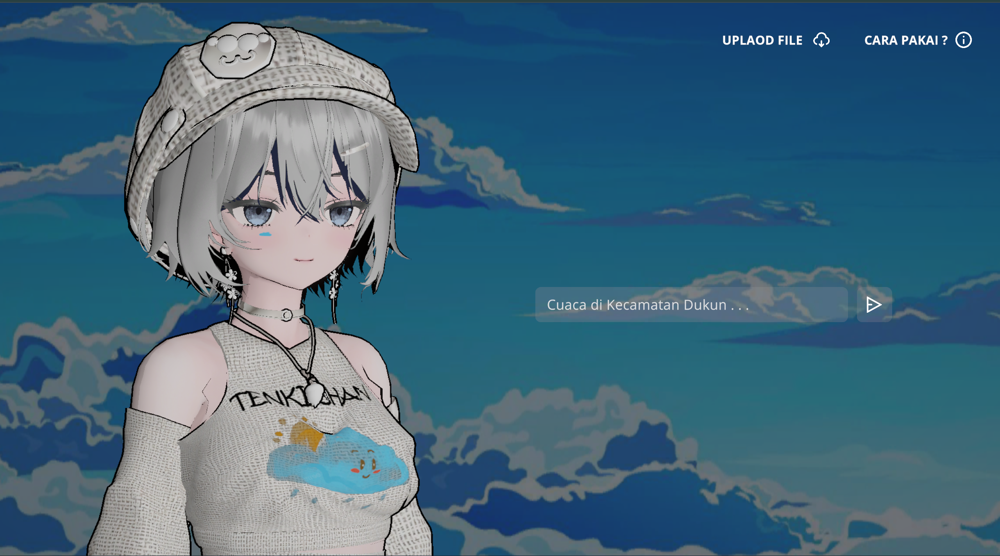
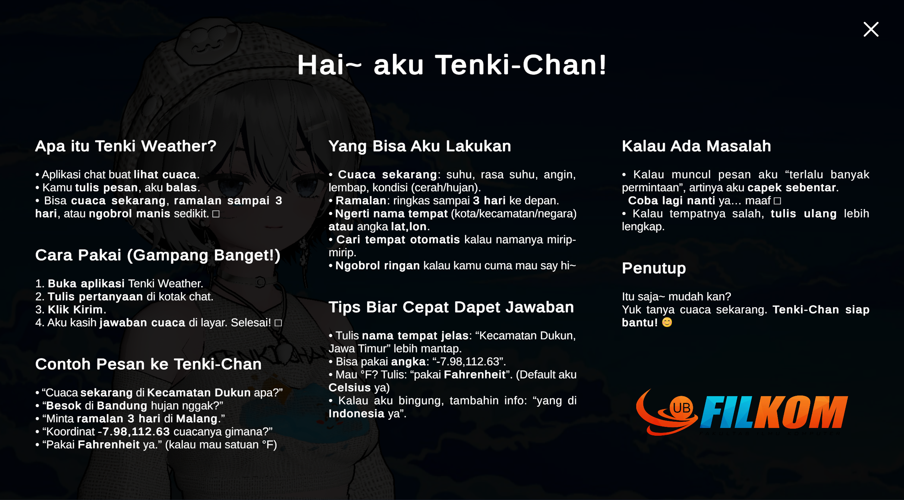
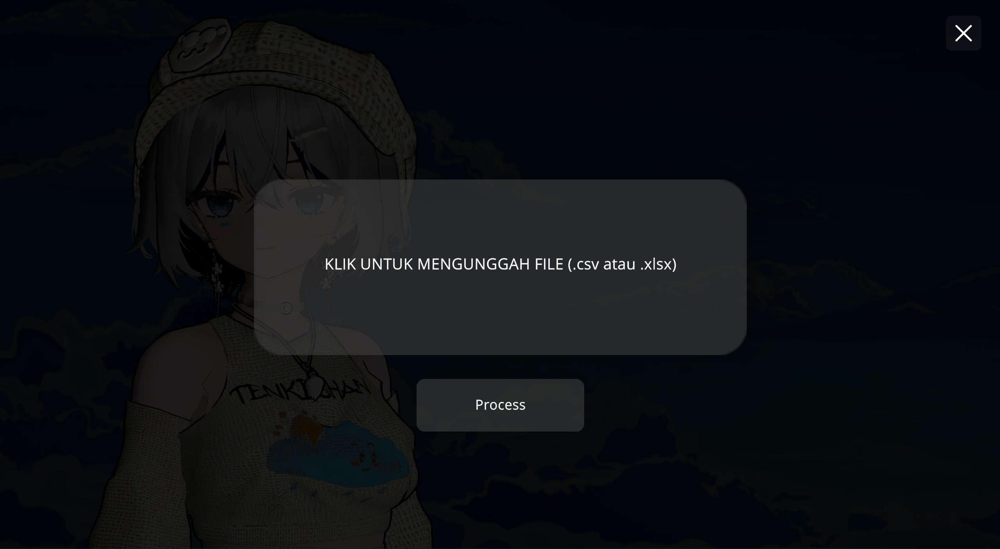

# Tenki Weather

> An Indonesian-language weather chatbot featuring the anime character **Tenki‑Chan**. Built with **Unity 6 (6000.2.3f1)** for **WebGL only**, with **OpenAI**, **WeatherAPI.com**, **ElevenLabs**, and **CSV/XLSX batch processing**.

[](#)
[](#)
[](#license)
[](#)

**Live Demo:** *Not maintained anymore*

**Video Demo:** **[https://youtu.be/h3AnszT8V-c](https://youtu.be/h3AnszT8V-c)**  


Theme/brand: **Light Blue Sky**

---

## Features

* **Weather & Chitchat Intent** — Uses **OpenAI** with a strict JSON-only schema.
* **Current Weather & Forecasts** — Powered by **WeatherAPI.com**, using place names or `lat,lon` coordinates.
* **Indonesian TTS** — Uses **ElevenLabs** with Unity **AudioSource**.
* **CSV/XLSX Batch Processing** — Parallel worker pool with `maxConcurrency`, retry/backoff, and CSV/XLSX export.
* **Tenki‑Chan Avatar** — Uses **Animation Rigging**, **uLipSync**, and **Magica Cloth 2**.
* **WebGL Only** — Built with Unity 6 **6000.2.3f1**.


---

## Architecture



---

## Technology

| Component | Role |
| --- | --- |
| Unity 6 (6000.2.3f1) | WebGL engine/build |
| TextMeshPro | Text UI |
| Michsky DreamOS | UI/UX |
| Animation Rigging | Character rigging |
| uLipSync | Real-time lip-sync |
| Magica Cloth 2 | Cloth/accessory simulation |
| OpenAI API | Intent planning and response generation |
| WeatherAPI.com | Weather data |
| ElevenLabs | Indonesian TTS |


---

## Batch Mode (CSV/XLSX)

Accepted headers:

* **Name**: `name|nama|kecamatan`
* **Latitude**: `lat|latitude|lintang`
* **Longitude**: `lon|lng|longitude|bujur`

1. Upload a **.csv** or **.xlsx** file.
2. Press **Process**.
3. Download the result as **CSV** or **XLSX**.

Main settings:

* `maxConcurrency` — parallel workers, default **48**.
* `maxRetries` — retry attempts, default **3**.

Output columns:

`Name, Latitude, Longitude, Last Update, Temperature (°C), Humidity (%), Condition, Wind Speed (kph), Wind Direction, UV Index`

---

## Security

> **API keys embedded in WebGL can be inspected by users.** Use restricted quotas, rotate keys, or proxy requests through **Unity Cloud Code / Relay**.

```
This is Ren from the future. The API key are all rotated and not works anymore. Go try it
```

OpenAI, WeatherAPI.com, and ElevenLabs may return **HTTP 429** when rate limits are reached. Batch processing includes retry/backoff handling.

---

## Screenshots






---

## License

**Copyright (c) Shirasaka Ren**

Released under the **MIT License**.

```
MIT License

Copyright (c) Shirasaka Ren

Permission is hereby granted, free of charge, to any person obtaining a copy of this software and associated documentation files (the "Software"), to deal in the Software without restriction, including without limitation the rights to use, copy, modify, merge, publish, distribute, sublicense, and/or sell copies of the Software, and to permit persons to whom the Software is furnished to do so, subject to the following conditions:

The above copyright notice and this permission notice shall be included in all copies or substantial portions of the Software.

THE SOFTWARE IS PROVIDED "AS IS", WITHOUT WARRANTY OF ANY KIND, EXPRESS OR IMPLIED, INCLUDING BUT NOT LIMITED TO THE WARRANTIES OF MERCHANTABILITY, FITNESS FOR A PARTICULAR PURPOSE AND NONINFRINGEMENT. IN NO EVENT SHALL THE AUTHORS OR COPYRIGHT HOLDERS BE LIABLE FOR ANY CLAIM, DAMAGES OR OTHER LIABILITY, WHETHER IN AN ACTION OF CONTRACT, TORT OR OTHERWISE, ARISING FROM, OUT OF OR IN CONNECTION WITH THE SOFTWARE OR THE USE OR OTHER DEALINGS IN THE SOFTWARE.
```
